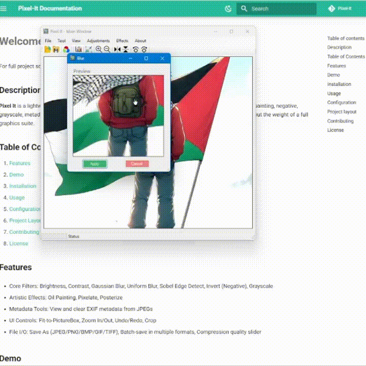

# **Blur (Uniform Blur)**

## What it does

The **Blur** filter applies a simple `3×3` averaging kernel (each weight = 1/9) around every pixel, smoothing out noise and softening edges.

## Preview

<figure markdown="span">
  { width="600" }
  <figcaption>Uniform Blur Preview</figcaption>
</figure>

## Usage in Code

```csharp title="Blur.cs" linenums="1" hl_lines="13-15"
private int Clamp(int value)
{
    return Math.Max(0, Math.Min(255, value));
}

private Bitmap ApplyBlurFilter(Bitmap sourceImage)
{
    Bitmap newImage = new Bitmap(sourceImage.Width, sourceImage.Height);

    float[,] kernel = {
        { 1f/9f, 1f/9f, 1f/9f },
        { 1f/9f, 1f/9f, 1f/9f },
        { 1f/9f, 1f/9f, 1f/9f }
    };

    int width  = sourceImage.Width;
    int height = sourceImage.Height;

    for (int x = 1; x < width - 1; x++)
    for (int y = 1; y < height - 1; y++)
    {
        float r = 0, g = 0, b = 0;

        // Convolution
        for (int ky = -1; ky <= 1; ky++)
        for (int kx = -1; kx <= 1; kx++)
        {
            Color p = sourceImage.GetPixel(x + kx, y + ky);
            float w = kernel[ky + 1, kx + 1];
            r += p.R * w;
            g += p.G * w;
            b += p.B * w;
        }

        int a = sourceImage.GetPixel(x, y).A;
        Color nc = Color.FromArgb(a,
            Clamp((int)r),
            Clamp((int)g),
            Clamp((int)b)
        );
        newImage.SetPixel(x, y, nc);
    }

    return newImage;
}
```

!!! info "Blur"

    Uniform blur is fast but can produce “boxy” artifacts. For a softer fall-off, see [Gaussian Blur](./).
