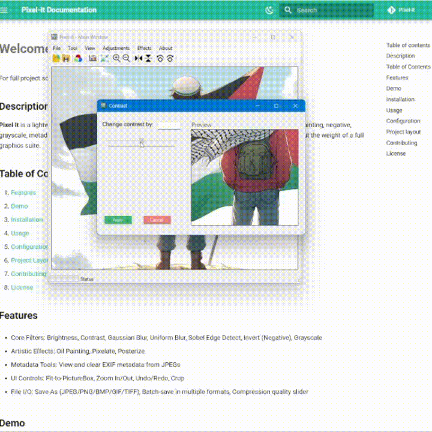

# **Contrast**

## What it does

The **Contrast** filter increases the difference between dark and light areas by scaling each color channel around the midpoint (128). Positive values boost contrast, negative values reduce it.

## Preview

<figure markdown="span">
  { width="600" }
  <figcaption>Contrast Filter Preview</figcaption>
</figure>

## Usage in Code

```csharp title="Contrast.cs" linenums="1" hl_lines="14-20"
private int Clamp(int value)
{
    return Math.Max(0, Math.Min(255, value));
}

private Bitmap ApplyContrastFilter(Bitmap sourceImage, int contrast)
{
    Bitmap newImage = new Bitmap(sourceImage.Width, sourceImage.Height);
    double factor = 259.0 * (contrast + 255.0) / (255.0 * (259.0 - contrast));

    for (int x = 0; x < sourceImage.Width; x++)
    for (int y = 0; y < sourceImage.Height; y++)
    {
        Color p = sourceImage.GetPixel(x, y);

        int r = Clamp((int)(factor * (p.R - 128) + 128));
        int g = Clamp((int)(factor * (p.G - 128) + 128));
        int b = Clamp((int)(factor * (p.B - 128) + 128));

        newImage.SetPixel(x, y, Color.FromArgb(p.A, r, g, b));
    }

    return newImage;
}
```

<!-- !!! info "Contrast"

    XXXXXXXXXXXXXXXXXXXXXXXXXXX -->

