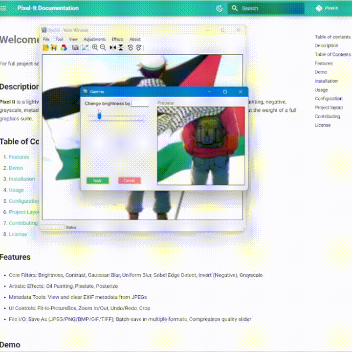

# **Gamma Correction**

## What it does

Adjusts each color channel non-linearly via a power-law (`output = 255 × (input/255)^(1/γ)`), brightening or darkening midtones without clipping highlights/shadows.

## Preview

<figure markdown="span">
  { width="600" }
  <figcaption>Gamma adjustments at γ=0.5 (brighter) and γ=2.0 (darker)</figcaption>
</figure>

## Usage in Code

```csharp title="Gamma.cs" linenums="1" hl_lines="13-15"
private int Clamp(int v) => Math.Max(0, Math.Min(255, v));

private Bitmap ApplyGammaFilter(Bitmap src, double gamma)
{
    int w = src.Width, h = src.Height;
    Bitmap outBmp = new Bitmap(w, h);

    for (int x = 0; x < w; x++)
    for (int y = 0; y < h; y++)
    {
        Color p = src.GetPixel(x, y);
        double inv = 1.0 / gamma;

        int r = Clamp((int)(Math.Pow(p.R/255.0, inv) * 255));
        int g = Clamp((int)(Math.Pow(p.G/255.0, inv) * 255));
        int b = Clamp((int)(Math.Pow(p.B/255.0, inv) * 255));

        outBmp.SetPixel(x, y, Color.FromArgb(p.A, r, g, b));
    }

    return outBmp;
}
```

!!! info "XXXXXXXXXXXXXXXXXXXX"
    XXXXXXXXXXXXXXXXXXXXXXXXXXXXXXXXXXXXXXXXXXXXXXXXXXXXXXXXXXXXXXXXXXXXXXXXXXXXXXXXXXXXXXXXXXXXXXXXXXXXXXXXXXXXXXXXXXXXXXXXXXXXXXXXXXXXXXXXXXXXXXXXXXXXXXXXXXXXXXXXXXXXXXXXXXXXXXXXXXXX
