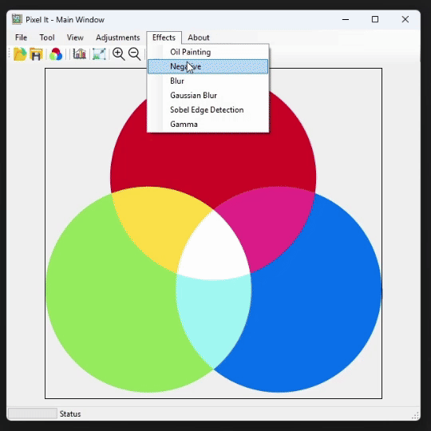

# **Negative (Invert Colors)**:

## What it does

The Negative filter inverts every pixel’s color by subtracting each RGB component from `255`, producing a photographic “negative” effect. Bright areas become dark, and cool tones swap to warm tones.


## Preview

<figure markdown="span">
  { width="600" }
  <figcaption>Negative Filter Preview</figcaption>
</figure>

## Usage in Code

``` csharp title="Negative.cs" linenums="1" hl_lines="13-15"
private Bitmap ApplyNegativeFilter(Bitmap sourceImage)
{
    int width  = sourceImage.Width;
    int height = sourceImage.Height;
    Bitmap newImage = new Bitmap(width, height);

    for (int x = 0; x < width; x++)
    {
        for (int y = 0; y < height; y++)
        {
            Color px = sourceImage.GetPixel(x, y);
            // Invert each channel
            int r = 255 - px.R;
            int g = 255 - px.G;
            int b = 255 - px.B;

            Color inverted = Color.FromArgb(px.A, r, g, b);
            newImage.SetPixel(x, y, inverted);
        }
    }

    return newImage;
}
```

!!! info "Negative (photography)"

    In photography, a negative is an image, usually on a strip or sheet of transparent plastic film, in which the lightest areas of the photographed subject appear darkest and the darkest areas appear lightest. [`Wiki`](https://en.wikipedia.org/wiki/Negative_(photography))
    