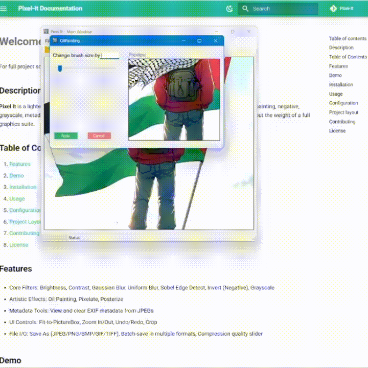

# **Oil Painting Effect**

## What it does

Simulates a painterly look by grouping neighborhood pixels by intensity, then replacing each pixel with the average color of the most frequent intensity bin in its brush-sized region.

## Preview

<figure markdown="span">
  { width="600" }
  <figcaption>Oil painting with brush size = 5</figcaption>
</figure>

## Usage in Code

```csharp title="OilPainting.cs"  linenums="1" hl_lines="8-20"
private Bitmap ApplyOilPaintingBrushSize(Bitmap source, int brushSize)
{
    const int intensityLevels = 30;

    for (int x = 0; x < width; x++)
    for (int y = 0; y < height; y++)
    {
        for (int nx = Math.Max(0, x - brushSize); nx <= Math.Min(width - 1, x + brushSize); nx++)
        {
            for (int ny = Math.Max(0, y - brushSize); ny <= Math.Min(height - 1, y + brushSize); ny++)
            {
                Color p = source.GetPixel(nx, ny);
                int intensity = (int)(((p.R + p.G + p.B) / 3.0) * intensityLevels / 255.0);
                if (intensity >= intensityLevels) intensity = intensityLevels - 1;

                count[intensity]++;
                sumR[intensity] += p.R;
                sumG[intensity] += p.G;
                sumB[intensity] += p.B;
            }
        }

        int maxCount = 0, bestIdx = 0;
        for (int i = 0; i < intensityLevels; i++)
        {
            if (count[i] > maxCount)
            {
                maxCount = count[i];
                bestIdx = i;
            }
        }

        Color original = source.GetPixel(x, y);
        int r = sumR[bestIdx] / maxCount;
        int g = sumG[bestIdx] / maxCount;
        int b = sumB[bestIdx] / maxCount;
        result.SetPixel(x, y, Color.FromArgb(original.A, r, g, b));
    }

    return result;
}
```

<!-- !!! info "XXXXXXXXXXXXXXXXXXXX"
    XXXXXXXXXXXXXXXXXXXXXXXXXXXXXXXXXXXXXXXXXXXXXXXXXXXXXXXXXXXXXXXXXXXXXXXXXXXXXXXXXXXXXXXXXXXXXXXXXXXXXXXXXXXXXXXXXXXXXXXXXXXXXXXXXXXXXXXXXXXXXXXXXXXXXXXXXXXXXXXXXXXXXXXXXXXXXXXXXXXX -->