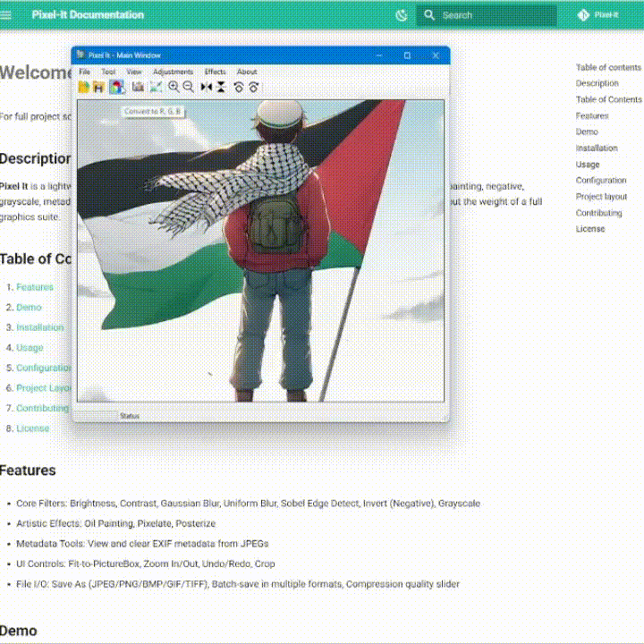

# **Color Channel Extractor**

## What it does

Extracts a single color channel (Red, Green, or Blue) by zeroing out the other two. Useful for examining per-channel detail.

## Preview

<figure markdown="span">
  { width="600" }
  <figcaption>Red, Green, and Blue channel isolation</figcaption>
</figure>

## Usage in Code

```csharp title="Convert_To_R_G_B.cs" linenums="1" hl_lines="13-19"
    public enum Colors { Red, Green, Blue};

    public static class IMG
    {
        public static Bitmap GetColor(Bitmap src, Colors c)
        {
            int w = src.Width, h = src.Height;
            Bitmap ret = new Bitmap(w, h);

            for (int i = 0; i < w; ++i)
            for (int j = 0; j < h; ++j)
            {
                Color pixel = src.GetPixel(i, j);
                int r = 0, g = 0, b = 0;
                if (c == Colors.Red) r = pixel.R; 
                else if (c == Colors.Green) g = pixel.G;
                else if (c == Colors.Blue) b = pixel.B;
                
                ret.SetPixel(i, j, Color.FromArgb(r, g, b));
            }
            return ret;
        }

```

<!-- !!! info "XXXXXXXXXXXXXXXXXXXX"
    XXXXXXXXXXXXXXXXXXXXXXXXXXXXXXXXXXXXXXXXXXXXXXXXXXXXXXXXXXXXXXXXXXXXXXXXXXXXXXXXXXXXXXXXXXXXXXXXXXXXXXXXXXXXXXXXXXXXXXXXXXXXXXXXXXXXXXXXXXXXXXXXXXXXXXXXXXXXXXXXXXXXXXXXXXXXXXXXXXXX -->
