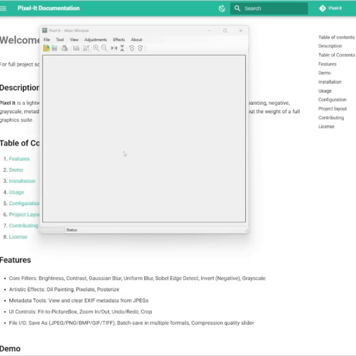

# Welcome to Pixel-It

For full project source codes visit [Pixel-It](https://github.com/3bbaas/Pixel-It).

## Description
**Pixel It** is a lightweight C# WinForms image-editor that lets you apply filters—brightness, contrast, blur, oil-painting, negative, grayscale, metadata viewing/clearing, and more—to any bitmap. It’s perfect for quick, pixel-level edits without the weight of a full graphics suite.

## Table of Contents

1. [Demo](#demo)
2. [Features](#features)
3. [Installation](#installation)
4. [Usage](#usage)
5. [Configuration](#configuration)
6. [Project Layout](#project-layout)
7. [Contributing](#contributing)
8. [License](#license)


## Demo
<br>

<figure markdown="span">
  { width="600" }
  <figcaption>Main Window App</figcaption>
</figure>

## Features
- Core Filters: Brightness, Contrast, Gaussian Blur, Uniform Blur, Sobel Edge Detect, Invert (Negative), Grayscale 

- Artistic Effects: Oil Painting, Pixelate, Posterize 

- Metadata Tools: View and clear EXIF metadata from JPEGs 

- UI Controls: Fit-to-PictureBox, Zoom In/Out, Undo/Redo, Crop 

- File I/O: Save As (JPEG/PNG/BMP/GIF/TIFF), Batch-save in multiple formats, Compression quality slider 

## Installation

1. Clone the repo
```bash
git clone https://github.com/3bbaas/Pixel-It.git
cd pixel_it
```
2. Open in Visual Studio 2019+ (requires .NET 5/6).
3. Restore NuGet packages, including [MetadataExtractor] for EXIF
4. Build & Run the Pixel_It project.

## Usage
1. Load an image via File :arrow_right: Open.
2. Select a filter from the toolbar (e.g., Brightness, Contrast).
3. Adjust parameters with trackbars or numeric fields.
4. Preview updates in real time (Fit/Zoom controls available).
5. Apply to commit or Cancel to revert.
6. Save As to write out the edited bitmap.

## Configuration  
- **JPEG Quality**: Default 90%; adjustable in the Compress dialog.
- **Undo Depth**: Unlimited snapshots via Memento pattern (configurable in code).  
- **Metadata Columns**: Defined in `MetaData` form’s `ListView` columns.  

## Project layout
    Pixel-It:

    ├───.github
    │   └───workflows
    ├───docs        # docs directory.
    │   └─── ... 
    ├───Pixel-It
    │       About.cs
    │       About.Designer.cs
    │       About.resx
    │       App.config
    │       Blur.cs
    │       Blur.Designer.cs
    │       Blur.resx
    │       Brightness.cs
    │       Brightness.Designer.cs
    │       Brightness.resx
    │       Compress.cs
    │       Compress.Designer.cs
    │       Compress.resx
    │       Contrast.cs
    │       Contrast.Designer.cs
    │       Contrast.resx
    │       Convert_To_R_G_B.cs
    │       Convert_To_R_G_B.Designer.cs
    │       Convert_To_R_G_B.resx
    │       DoubleBufferDisplay.cs
    │       DoubleBufferDisplay.Designer.cs
    │       DoubleBufferDisplay.resx
    │       FilterPreview.cs
    │       FilterPreview.resx
    │       Form1.cs
    │       Form1.Designer.cs
    │       Form1.resx
    │       Gamma.cs
    │       Gamma.Designer.cs
    │       Gamma.resx
    │       GaussianBlur.cs
    │       GaussianBlur.Designer.cs
    │       GaussianBlur.resx
    │       GetHistogram.cs
    │       Greyscale.cs
    │       Greyscale.Designer.cs
    │       Greyscale.resx
    │       harrow.cur
    │       Histogram.cs
    │       Histogram.Designer.cs
    │       Histogram.resx
    │       hmove.cur
    │       MetaData.cs
    │       MetaData.Designer.cs
    │       MetaData.resx
    │       Negative.cs
    │       Negative.Designer.cs
    │       Negative.resx
    │       OilPainting.cs
    │       OilPainting.Designer.cs
    │       OilPainting.resx
    │       packages.config
    │       Pixel-It.csproj
    │       Pixel_it app icon.ico
    │       Program.cs
    │       Sobel.cs
    │    
    ├───Aforge/			   # The Aforge.Net DLLs folder.
    │       AForge.Controls.dll
    │       AForge.dll
    │       AForge.Imaging.dll
    │       AForge.Math.dll
    │
    └───assets/ 			# The assets folder.
            app-about-icon.png
            flip_horizontal.png
            ... 

## Contributing  
We welcome pull requests!  

1. Fork the repo  
2. Create your feature branch (`git checkout -b feature/XYZ`)  
3. Commit your changes (`git commit -m "Add XYZ"`)  
4. Push (`git push origin feature/XYZ`)  
5. Open a Pull Request  

## License  
This project is licensed under the **MIT License**. See [LICENSE](https://github.com/3bbaas/Pixel-It/blob/master/LICENSE.txt) for details.